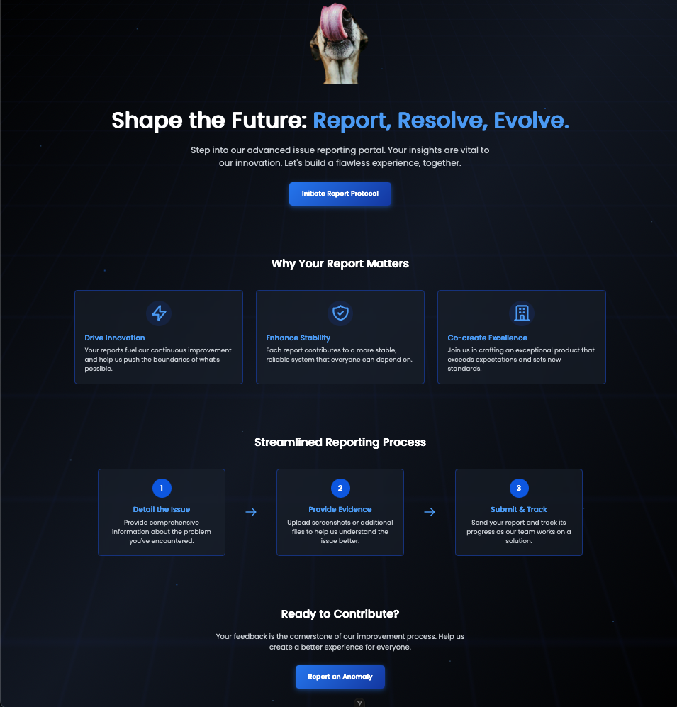
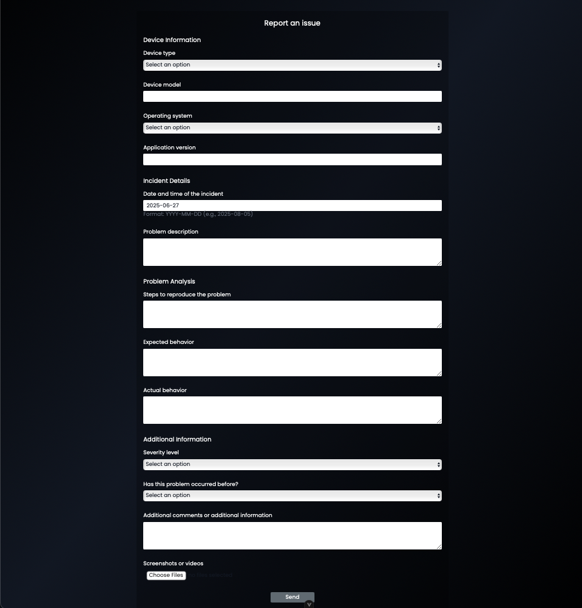

# Issue Reporting Portal

## Overview

The Issue Reporting Portal is a sophisticated, full-stack web application designed to streamline the process of reporting and tracking software issues. Built with a modern, decoupled architecture, this platform enables users to submit detailed reports through an intuitive interface. The backend leverages an asynchronous, queue-based processing system to handle submissions efficiently, generate PDF summaries, and notify users via email, ensuring a robust and scalable solution.
## Features

- **Intuitive User Interface**: A sleek, responsive design with smooth animations and clear navigation.
- **Comprehensive Reporting Form**: Collects detailed information including device specifics, incident details, and problem analysis.
- **File Uploads**: Supports screenshot and video uploads directly to cloud storage for visual evidence.
- **Asynchronous Processing**: Utilizes a message queue (Google Cloud Pub/Sub) to process submissions in the background, providing an instantaneous response to the user.
- **Automatic PDF Generation**: Creates formatted PDF reports from the submitted data.
- **Email Confirmations**: Automatically sends a confirmation email to the user with their full report attached as a PDF.
- **Secure Cloud Storage**: Reliably stores all user-uploaded files and generated reports on AWS S3.

## Screenshots

## Technology Stack

### Frontend
- **Vue.js 3**: Progressive JavaScript framework with Composition API
- **TypeScript**: Type-safe JavaScript superset
- **Tailwind CSS**: Utility-first CSS framework for responsive design
- **Vue Router**: Official router for Vue.js applications
- **Element Plus**: UI component library for Vue 3

### Backend
- **Deno**: Secure runtime for JavaScript and TypeScript
- **Hono**: Lightweight, fast web framework for Deno
- **Supabase**: Open-source Firebase alternative for database and authentication
- **Zod**: TypeScript-first schema validation
- **AWS S3**: Cloud storage for files and assets
- **PDF-lib**: PDF generation and manipulation
- **Asynchronous Messaging: Google Cloud Pub/Sub**: Background job processing
- **Transactional Emails**: Resend

### Deployment & DevOps
- **Frontend Hosting: Netlify**: Leveraging its Edge Network for global content delivery
- **Backend Hosting: Fly.io**: Running containerized API and Worker processes via Docker

## License

This project is licensed under the MIT License - see the LICENSE file for details.

